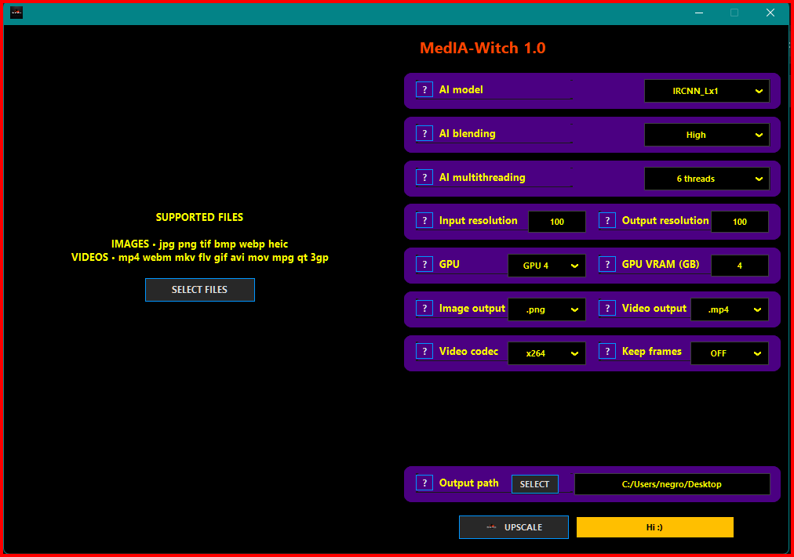

[Download from the Homepage](https://warlockhub-17vu0fo.gamma.site/warlockhub)

# MedIA-Witch

### AI-Based Image and Video Enhancement Tool

**MedIA-Witch** is a powerful open-source desktop application for enhancing images and videos using advanced AI models. Based on [QualityScaler](https://github.com/Djdefrag/QualityScaler), the tool integrates optimized models such as **Real-ESRGAN**, **SRGAN**, **BSRGAN**, and **IRCNN**, offering an easy-to-use interface to improve the quality and resolution of your media.

---

---

## 🚀 Installation

Follow these steps to get started with **MedIA-Witch**:

1. **Run the installer** and follow the on-screen instructions.
2. **Launch the application**: Run MedIA-Witch.exe on your Windows system.
3. **Start enhancing your images and videos!**

MedIA-Witch uses [PyInstaller](https://www.pyinstaller.org/) and [InnoSetup](http://www.jrsoftware.org/isinfo.php) for easy installation and executable creation.

---

## 🌟 Key Features

- **Advanced AI Models for Quality Enhancement:**

  - **Real-ESRGAN**, **SRGAN**, **BSRGAN**, and **IRCNN** for enhancing image and video quality, reducing noise, and effectively increasing resolution.

- **Batch Processing:**
  Improve multiple images and videos at the same time, ideal for restoring entire collections.

- **Customizable Settings:**
  Allows configuring output resolution, image/video format, and selecting the most suitable AI model for the best results.

- **User-Friendly Interface:**
  Perfect for users of all levels, with an interface that simplifies media enhancement with just a few clicks.

- **Open-Source:**
  MedIA-Witch is available under the **MIT License**, allowing free modification and extension of its functionality.

## 🛠️ How to Use

1. **Launch the application**: Run MedIA-Witch.exe as administrator for better performance.
2. **Select your file**: Upload images, videos, or entire folders to enhance.
3. **Configure the settings**:
   - **Choose the AI model** (Real-ESRGAN, SRGAN, BSRGAN, IRCNN, etc.).
   - **Adjust output resolution** and format (PNG, JPEG, MP4, etc.).
4. **Start the process**: Click the **Start** button and let MedIA-Witch do its work.
5. **Save the enhanced files**: Once the process is complete, the files will be saved in the selected location.

---

## 🔍 Quality Comparison

---

## 📊 System Requirements

- **Operating System**: Windows 10 or later.
- **RAM**: Minimum 4GB, recommended 8GB or more.
- **GPU**: A **NVIDIA GPU** is recommended for faster processing.
- **Storage**: Enough space for output files depending on the size and number of processed media.

## 📜 Credits and License

**MedIA-Witch** is based on [QualityScaler](https://github.com/Djdefrag/QualityScaler.git) and integrates several open-source technologies, including:

- **[QualityScaler](https://github.com/Djdefrag/QualityScaler.git)** – The main engine for image and video enhancement with AI. (MIT License)
- **[Real-ESRGAN](https://github.com/xinntao/Real-ESRGAN)** – Model for enhancing image resolution. (BSD License)
- **[SRGAN](https://github.com/tensorlayer/SRGAN)** – Generative Adversarial Network for super-resolution. (For academic and non-commercial use only)
- **[BSRGAN](https://github.com/cszn/BSRGAN)** – Generative Adversarial Network for degraded images. (Apache License)
- **[IRCNN](https://github.com/lipengFu/IRCNN.git)** – Model for noise reduction and image enhancement.
- **[ONNX Runtime](https://onnxruntime.ai/)** – Optimized engine for running deep learning models. (Apache License 2.0)
- **[FFmpeg](https://ffmpeg.org/)** – Multimedia framework for image and video processing. (LGPL-2.1 or later)
- **[PyInstaller](https://www.pyinstaller.org/)** – Tool for packaging MedIA-Witch into an executable file. (GPLv2 or later)
- **[Inno Setup](http://www.jrsoftware.org/isinfo.php)** – Installer creator. (Inno Setup License)

MedIA-Witch is distributed under the **MIT License**. Please refer to the [LICENSE](LICENSE.md) file for more details.

## 🤝 Contributions

Contributions are welcome! To collaborate:

1. **Fork** the repository and create a new branch.
2. **Make your improvements** or fixes.
3. **Submit a pull request** with a clear description of the changes.

If you have feedback, bug reports, or suggestions, contact us at [negroayub97@gmail.com](mailto:negroayub97@gmail.com).

---

**MedIA-Witch** is a powerful tool driven by open-source technologies, continuously evolving with new improvements to offer you the best media quality. Enjoy enhancing your images and videos! 🚀
